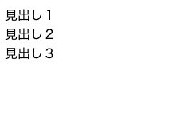
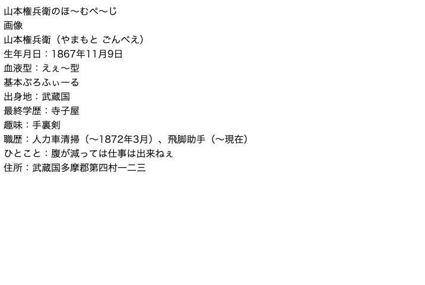
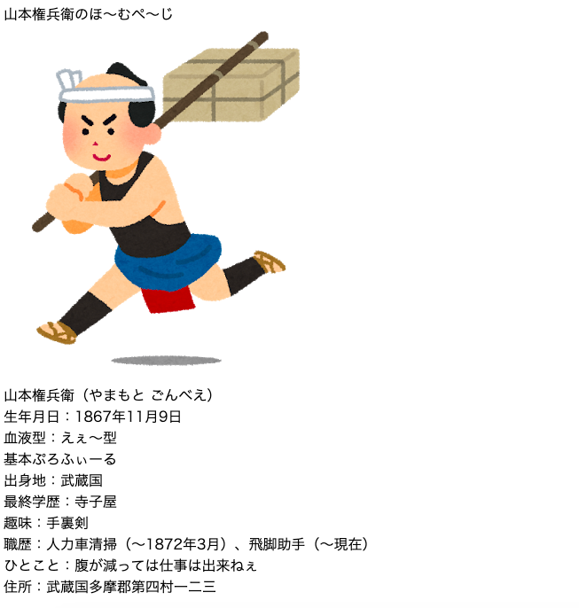
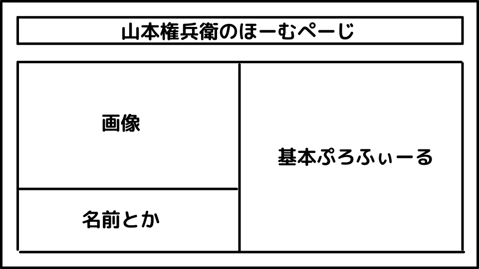

# 阿部寛のホームページ風サイトを作成しよう
このドキュメントでは、阿部寛さんのホームページ風のサイトを作成するためのエッセンスと記事をまとめたものです。

## 阿部寛のホームページが優れている理由
俳優・阿部寛さんのホームページはトラディショナルなデザインですが、データ通信量を超過してしまい速度制限がかかってしまってもスムーズに表示ができるシンプルな構造です。  

[阿部 寛のホームページ](http://abehiroshi.la.coocan.jp/)

以下の記事では阿部寛さんのホームページが優れている理由を解説されています。

[なぜ阿部寛のホームページはベストを尽くさないのか。](https://qiita.com/mackey0022/items/0258ceddc7acd8626332)  


## 実際にホームページを作成してみる
以下の記事では作成方法が解説されています。SEOに関しても基本的な部分が解説されているので、一読することをオススメします。  

[阿部寛と学ぶHTMLチュートリアル](https://qiita.com/Michinosuke/items/ff696189ecd518da3d3a)  

ここからは上記のチュートリアル記事を補足する形で、解説をしていきます。Webページの作成において、基本的に使用するものは同じです。  

環境構築を完了し、HTMLファイルを作成した前提で解説します。

## まずはHTMLの雛形を入力する

まずはHTMLを記述する場合の基本の方を入力します。

```html
<!DOCTYPE html>
<html lang="en">
<head>
    <meta charset="UTF-8">
    <meta http-equiv="X-UA-Compatible" content="IE=edge">
    <meta name="viewport" content="width=device-width, initial-scale=1.0">
    <title>Document</title>
</head>
<body>
    
</body>
</html>
```

VScodeで作成する場合 
```
html:5
```
で自動入力できます。

## 雛形に使用されているタグの解説

上記の雛形に使用されているタグについて解説します。  

既にHTMLについてある程度理解がある方や早くページを作成したい方は読み飛ばしていただいて結構です。

- Doctype宣言（ドクタイプ宣言）  
```html
<!DOCTYPE html>
```
Doctype宣言は、このページがどのバージョンのHTMLで記述されているかをしているものです。特に指定がない場合、HTML5を指します。

- html
```html
<html></html>
```
ページがHTMLで記述されていることを示します。Doctype宣言の直後に記述することが一般的です。開始タグと終了タグでワンセットです。

- head
```html
<head></head>
```
ページのタイトル、説明文、外部ファイル（CSSファイルなど）のリンク、ページ情報を記述します。ブラウザでは表示されません。

- meta
```html
<meta>
```
ページ情報、文字コード、説明文などを記述します。metaタグには終了タグがありません。

- title
```html
<title></title>
```
ページのタイトルを記述します。ブラウザのタブに表示されます。

- body
```html
<body></body>
```
ページのタイトル、説明文、外部ファイル（CSSファイルなど）のリンク、ページ情報を記述します。ブラウザでは表示されません。

## ページの中身を記述する
雛形ができたので中身を記述します。先ほどの雛形にコードを追加します。

```html
<!DOCTYPE html>
<html lang="en">
<head>
    <meta charset="UTF-8">
    <meta http-equiv="X-UA-Compatible" content="IE=edge">
    <meta name="viewport" content="width=device-width, initial-scale=1.0">
    <title>Document</title>
</head>
<body>
    <!--ここから-->
    <div>見出し１</div>
    <div>見出し２</div>
    <div>見出し３</div>
    <!--ここまで-->
</body>
</html>
```

コードを３行追加しました。ブラウザで表示してみましょう。  



このようにbodyタグにテキストを記述するとページに表示ができます。

## 新たに出てきたタグの解説
- div
```html
<div></div>
```
このタグは単体で使用する場合、特に意味を持ちません。しかし、HTMLでページを作成する際に最も多様されるタグです。  

属性を付与することで意味付けを行い、テキストの配置やデザインを調整します。  

## divタグのみを用いてページをデザインする
HTMLについて解説している記事の大半は先にいろいろなタグを覚えるように推奨しますが、あまり意味がないと思います。HTMLを利用する目的はWebページを作成するためであり、タグを覚える事ではありません。フレームを組んで必要なコンテンツを書き出して表示することは、divタグだけでできます。  

他のタグを覚えるのは後で構いません。まずは作りましょう。はじめは必要なコンテンツをdivタグを用いて書き出します。  
```html
<!DOCTYPE html>
<html>
  <head>
    <meta charset="UTF-8">
    <meta http-equiv="X-UA-Compatible" content="IE=edge">
    <meta name="viewport" content="width=device-width, initial-scale=1.0">
    <title>Document</title>
  </head>
  <body>
    <!--ここから-->
    <div>山本権兵衛のほ〜むぺ〜じ</div>
    <div>画像</div>
    <div>山本権兵衛（やまもと ごんべえ）</div>
    <div>生年月日：1867年11月9日</div>
    <div>血液型：えぇ〜型</div>
    <div>基本ぷろふぃーる</div>
    <div>出身地：武蔵国</div>
    <div>最終学歴：寺子屋</div>
    <div>趣味：手裏剣</div>
    <div>職歴：人力車清掃（〜1872年3月）、飛脚助手（〜現在）</div>
    <div>ひとこと：腹が減っては仕事は出来ねぇ</div>
    <div>住所：武蔵国多摩郡第四村一二三</div>
    <!--ここまで-->
  </body>
</html>
```

最低限のコンテンツを追加しました。ブラウザで表示してみましょう。



最低限の必要事項を追加しました。

## 画像を追加する
ページに画像を追加します。先ほどdivタグで「画像」と入力した部分を置き換えます。

```html
<!DOCTYPE html>
<html>
  <head>
    <meta charset="UTF-8">
    <meta http-equiv="X-UA-Compatible" content="IE=edge">
    <meta name="viewport" content="width=device-width, initial-scale=1.0">
    <title>Document</title>
  </head>
  <body>
    <div>山本権兵衛のほ〜むぺ〜じ</div>
    <div>
        <!--ここから-->
        
        <!--ここまで-->
    </div>
    <div>山本権兵衛（やまもと ごんべえ）</div>
    <div>生年月日：1867年11月9日</div>
    <div>血液型：えぇ〜型</div>
    <div>基本ぷろふぃーる</div>
    <div>出身地：武蔵国</div>
    <div>最終学歴：寺子屋</div>
    <div>趣味：手裏剣</div>
    <div>職歴：人力車清掃（〜1872年3月）、飛脚助手（〜現在）</div>
    <div>ひとこと：腹が減っては仕事は出来ねぇ</div>
    <div>住所：武蔵国多摩郡第四村一二三</div>
  </body>
</html>
```

画像を追加しました。ブラウザで表示してみましょう。



## CSSを使って配置を決める
表示するコンテンツが揃ったので、スタイルシートを作成しCSSを適用していきます。阿部寛さんのホームページを参考にしつつ、以下のようなデザインで作成します。  

